<!-- ========================================================= -->
<!--                  VALENTINO ORIUNDO                        -->
<!--        DATA ANALYTICS • BI • DATA SCIENCE                 -->
<!-- ========================================================= -->


<!-- ========================= HERO ========================== -->

<p align="center">
  
</p>


<!-- ==================== DYNAMIC INTRO ====================== -->

<p align="center">
  
</p>


<!-- ======================= BADGES ========================= -->

<div align="center">

<a href="https://github.com/valentinooriundo">
  
</a>

<a href="https://www.tiktok.com/@evocodeteam">
  
</a>


</div>

<br>


<!-- ================= PROFESSIONAL PROFILE ================= -->

## `> Professional Profile`

```python
valentino = {
    "profession": "Systems Engineer",

    "specialization": [
        "Data Analytics",
        "Business Intelligence",
        "Data Science"
    ],

    "core_stack": [
        "SQL",
        "Power BI",
        "Python",
        "Excel"
    ],

    "data_tools": [
        "Pandas",
        "NumPy",
        "Matplotlib",
        "Power Query",
        "DAX"
    ],

    "databases": [
        "SQL Server",
        "PostgreSQL"
    ],

    "interests": [
        "Exploratory Data Analysis",
        "Data Visualization",
        "Machine Learning",
        "Predictive Analytics",
        "Computer Vision"
    ],

    "community": "EvoCodeTeam"
}
```

I am a **Systems Engineer** focused on **Data Analytics, Business Intelligence and Data Science**.

I use data, programming and visualization to transform complex information into **clear insights that support better decisions**.

My professional profile combines analytical thinking, business understanding, databases, data visualization and programming, while progressively integrating **statistics and machine learning** into my projects.

<p align="center">
  <strong>DATA → ANALYSIS → INSIGHTS → DECISIONS → INTELLIGENCE</strong>
</p>

---

<!-- ======================= STACK ========================= -->

## `> Technology Stack`

<div align="center">

### `DATA ANALYTICS & BUSINESS INTELLIGENCE`


<br><br>

### `PYTHON & DATA SCIENCE`


<br><br>

### `DATABASES`


<br><br>

### `DEVELOPMENT ENVIRONMENT`


</div>

---

<!-- ==================== CORE DOMAINS ====================== -->

## `> Core Domains`

<table>
<tr>

<td width="33%" valign="top">

<h3 align="center">📊 Data Analytics</h3>

<p align="center">
<code>SQL</code>
<code>Excel</code>
<code>Python</code>
</p>

- Exploratory Data Analysis
- Data Cleaning
- Business KPIs
- SQL Analysis
- Data Visualization
- Business Insights
- Data Storytelling

</td>

<td width="33%" valign="top">

<h3 align="center">📈 Business Intelligence</h3>

<p align="center">
<code>Power BI</code>
<code>DAX</code>
<code>Power Query</code>
</p>

- Interactive Dashboards
- Data Modeling
- Business Reporting
- KPI Monitoring
- Performance Analysis
- Decision Support
- Visual Storytelling

</td>

<td width="33%" valign="top">

<h3 align="center">🧠 Data Science</h3>

<p align="center">
<code>Python</code>
<code>Statistics</code>
<code>ML</code>
</p>

- Statistical Analysis
- Machine Learning
- Classification
- Predictive Analytics
- Model Evaluation
- Feature Analysis
- Computer Vision

</td>

</tr>
</table>

---

<!-- ==================== DATA WORKFLOW ===================== -->

## `> Analytical Approach`

```text
┌──────────────────┐
│ Business Problem │
└────────┬─────────┘
         │
         ▼
┌──────────────────┐
│       Data       │
└────────┬─────────┘
         │
         ▼
┌──────────────────┐
│ Cleaning & Prep  │
└────────┬─────────┘
         │
         ▼
┌──────────────────┐
│ Analysis & EDA   │
└────────┬─────────┘
         │
         ▼
┌──────────────────┐
│ Visualization    │
└────────┬─────────┘
         │
         ▼
┌──────────────────┐
│     Insights     │
└────────┬─────────┘
         │
         ▼
┌──────────────────┐
│ Business Decision│
└──────────────────┘
```

My objective is not simply to create dashboards or write queries.

The objective is to **understand the problem, analyze the data and communicate useful information for decision-making**.

---

<!-- ===================== PORTFOLIO ======================== -->

## `> Data Portfolio`

My GitHub portfolio is focused on developing projects that demonstrate practical analytical and technical capabilities.

<table>
<tr>

<td align="center" width="33%">

### 📊 Business Intelligence

Power BI dashboards  
DAX measures  
Data modeling  
Business KPIs

</td>

<td align="center" width="33%">

### 🗄️ SQL Analytics

Business queries  
Data exploration  
CTEs  
Window Functions

</td>

<td align="center" width="33%">

### 🐍 Python Analytics

Data Cleaning  
EDA  
Pandas  
Visualization

</td>

</tr>

<tr>

<td align="center" width="33%">

### 📈 Excel Analytics

Business analysis  
Pivot Tables  
Power Query  
Dashboards

</td>

<td align="center" width="33%">

### 👥 Customer Analytics

Segmentation  
Behavior Analysis  
KPIs  
Business Insights

</td>

<td align="center" width="33%">

### 🤖 Data Science

Machine Learning  
Classification  
Prediction  
Model Evaluation

</td>

</tr>
</table>

---

<!-- =================== GITHUB ANALYTICS ================== -->

## `> GitHub Analytics`

<div align="center">


</div>

<br>

<div align="center">


</div>

<br>

<div align="center">


</div>

---

<!-- ================= CONTRIBUTION MATRIX ================= -->

## `> Contribution Matrix`

<div align="center">

<picture>

  <source
    media="(prefers-color-scheme: dark)"
    srcset="https://raw.githubusercontent.com/valentinooriundo/valentinooriundo/output/github-contribution-grid-snake-dark.svg"
  />

  <source
    media="(prefers-color-scheme: light)"
    srcset="https://raw.githubusercontent.com/valentinooriundo/valentinooriundo/output/github-contribution-grid-snake.svg"
  />

  

</picture>

</div>

---

<!-- ===================== EVOCODETEAM ===================== -->

## `> EvoCodeTeam`

<div align="center">

### `MEMBER // EVOCODETEAM`

I am part of **EvoCodeTeam**, a technology community focused on building, learning and sharing knowledge through software, data and emerging technologies.

<br>

<a href="https://www.tiktok.com/@evocodeteam">
  
</a>

<br><br>

```text
BUILD  •  LEARN  •  SHARE  •  EVOLVE
```

</div>

---

<!-- ===================== CONNECT ========================= -->

## `> Connect`

<div align="center">

<a href="https://github.com/valentinooriundo">
  
</a>

<a href="https://www.tiktok.com/@evocodeteam">
  
</a>

</div>

<br>

---

<!-- ======================= FOOTER ======================== -->

<div align="center">

### `FROM DATA TO INTELLIGENCE`

**Systems Engineer • Data Analytics • Business Intelligence • Data Science**

<br>


<br><br>

```text
SYSTEM STATUS   : ONLINE
DATA PIPELINE   : READY
ANALYTICS MODE  : ACTIVE
NEXT INSIGHT    : LOADING...
```

</div>
